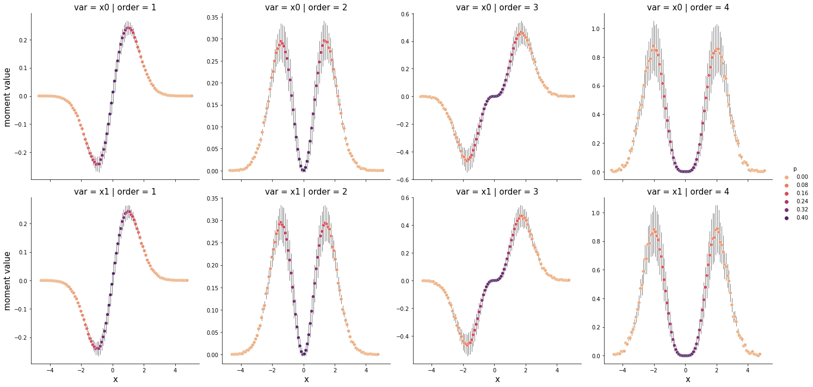

# Statistical Moments Plotter

This repository contains a python function `moments_plot` that plots the integrand of statistical moments of a given data for specified orders.

## Statistical Moments

Statistical moment is a value computed from the data set that describes its distributional properties, such as central tendency, spread or skewness. For a set of data points ${x_1, x_2, ..., x_n}$, the $n^{th}$ statistical moment is defined as:

$$E[(x - \bar{x})^n] = \frac{\Sigma (x_i - \bar{x})^n}{n}$$ 

The first moment is simply the ***mean***, the second moment is the ***variance***, and higher moments, known as central moments, capture more complex features of the distribution. These central moments can provide insights into the skewness and kurtosis of the distribution, helping to describe the shape of the data distribution shape beyond just the mean and variance. 

In terms of a probability density function, the $n^{th}$ central moment can be expressed as an integral:

$$E[(x - \bar{x})^n] = \int{p(x)(x - \bar{x})^n}$$

This function is designed to plot the integrand of the $n^{th}$ central moment, $p(x)(x - \bar{x})^n$. 

Depending on the size and distribution of the data, there may exist a critical order such that the tails of the plots for orders greater than this critical order diverge. This divergence indicates that the moments of higher orders from this data are not valid, as the tails of the distribution are not well-behaved and the moment calculations become unstable.

It is important to keep in mind that the validity of statistical moments depends on the data, and that in some cases, even the second moment (variance) may not be a meaningful measurement.


## Requirements

* numpy 1.20.3
* pandas 1.3.4
* matplotlib 3.6.2
* seaborn 0.11.2

## Documentation

***moments_plot(data, order, bins=300, row='var', column='order', palette='flare', )***

*This function plots the statistical moments of the given orders for a given data.*

### Parameters

**data**: the array of time-series, each column corresponds to a time-serie
> **type**: nd-array of shape (n, dims) in which n is the number of time points and dims is the dimension of data (number of time-series)

**order**: the order(s) of statistical moments to be plotted.
> **type**: an integer or an array-like

 **bins**: If bins is an int, it defines the number of equal-width bins in the given range (10, by default). If bins is a sequence, it defines the bin edges, including the rightmost edge, allowing for non-uniform bin widths. If bins is a string from the list {‘auto’, ‘fd’, ‘doane’, ‘scott’, ‘rice’, ‘sturges’, ‘sqrt’}, it selects the method used to calculate the optimal bin width; (optional, default: 300)
 > **type**: int or array-like or str

**row**: the name of column which is used for row of facetgrid, can only be 'var' or 'order'; if row='var', each line of facetgrid belongs to one of the time-series, if row='order', each line of facetgrid belongs to one of the given orders. (optional, default='var')
> **type**: str

 **column**: the name of column which is used for column of facetgrid, can only be 'var' or 'order' and should be different from the value of 'row'; if row='var', each line of facetgrid belongs to one of the time-series, if row='order', each line of facetgrid belongs to one of the given orders. (optional, default='order')
> **type**: str

**palette**: passed to sns.relplot as a palette. (optional, default='flare')
> **type**: a seaborn palette 

---------------

### Return

**return**: `sns.relplot`

## How to use

```python
from Moments_Plot import moments_plot

moments_plot(<data>, <order>, bins=300, row='var', column='order', palette='flare')
```

### Example

```python
from Moments_Plot import moments_plot

x = np.random.normal(size=(10 ** 6, 2))
moments_plot(x, order=[1, 2, 3, 4], row='var', column='order', bins=300, palette='flare')
```


## Contribution

If you would like to contribute to this repository, feel free to submit a pull request. Any contributions, no matter how small, are greatly appreciated!

## License

The MIT License (MIT)

Copyright (c) [2023] [Fatemeh Nikpanjeh]

Permission is hereby granted, free of charge, to any person obtaining a copy
of this software and associated documentation files (the "Software"), to deal
in the Software without restriction, including without limitation the rights
to use, copy, modify, merge, publish, distribute, sublicense, and/or sell
copies of the Software, and to permit persons to whom the Software is
furnished to do so, subject to the following conditions:

The above copyright notice and this permission notice shall be included in all
copies or substantial portions of the Software.

THE SOFTWARE IS PROVIDED "AS IS", WITHOUT WARRANTY OF ANY KIND, EXPRESS OR
IMPLIED, INCLUDING BUT NOT LIMITED TO THE WARRANTIES OF MERCHANTABILITY,
FITNESS FOR A PARTICULAR PURPOSE AND NONINFRINGEMENT. IN NO EVENT SHALL THE
AUTHORS OR COPYRIGHT HOLDERS BE LIABLE FOR ANY CLAIM, DAMAGES OR OTHER
LIABILITY, WHETHER IN AN ACTION OF CONTRACT, TORT OR OTHERWISE, ARISING FROM,
OUT OF OR IN CONNECTION WITH THE SOFTWARE OR THE USE OR OTHER DEALINGS IN THE
SOFTWARE.